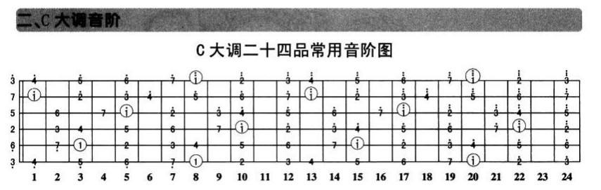
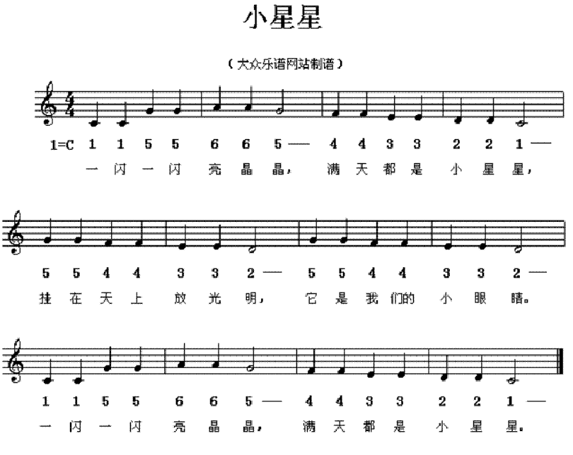
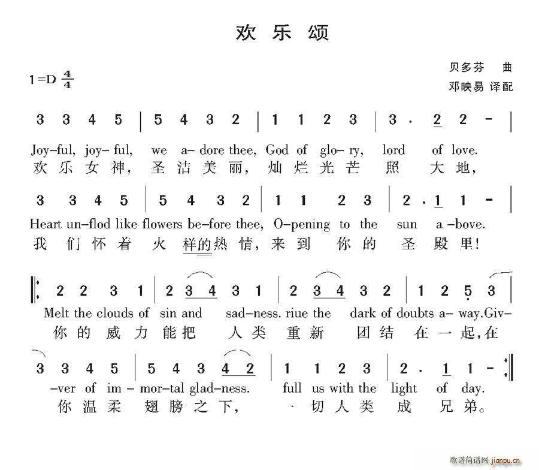
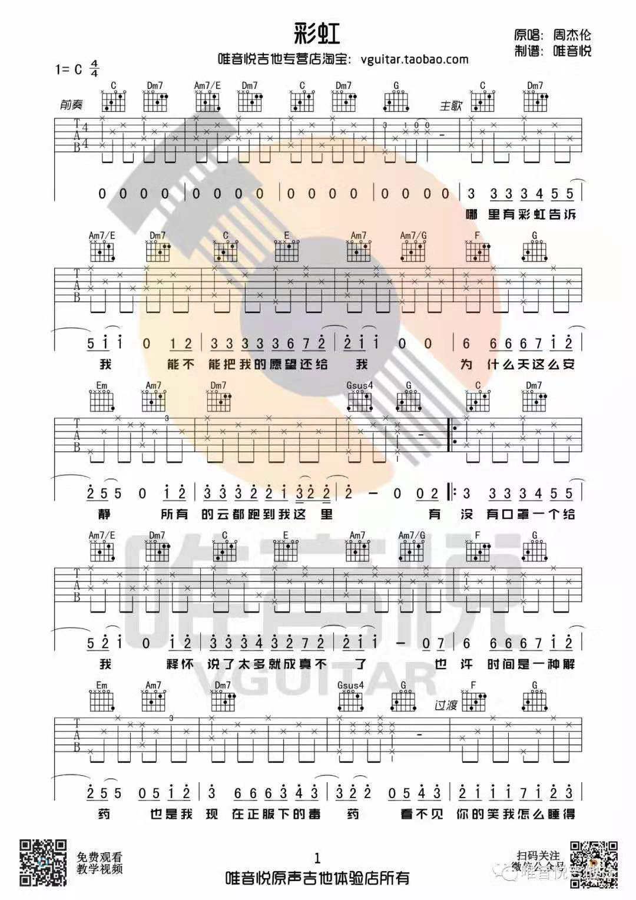
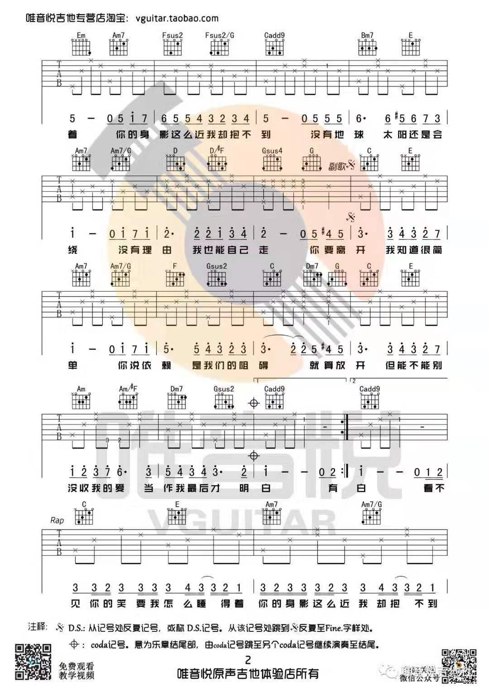
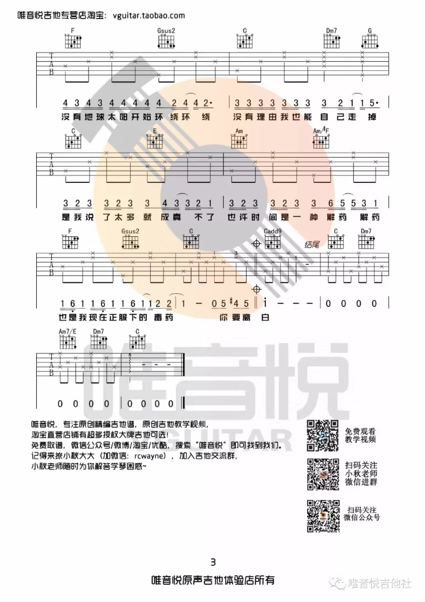

# guitar

---

调音器调音：

<https://www.bilibili.com/video/av40799340?from=search&seid=7216391862831788890>

在线节拍器：

<https://www.metronomeonline.com/dashboard/>

乐理：

链接：<https://pan.baidu.com/s/1DtO-F0a51ZeVqJGPGXnW0w> 提取码：nlta

吉他教学：

<https://www.bilibili.com/video/av7026144?from=search&seid=15158263202857946619> 

---

basic：

EADGBE调弦法是标准调弦法（standard），是人们几百年来摸索出来的最方便演奏乐曲的调弦法。

---

我爱你：

<https://www.bilibili.com/video/av62554295>

D A Bm G 两遍\
Em A Fm Bm 两遍\
E A

---

彩虹：

<https://www.bilibili.com/video/av22156372?from=search&seid=6062191441034075041>

